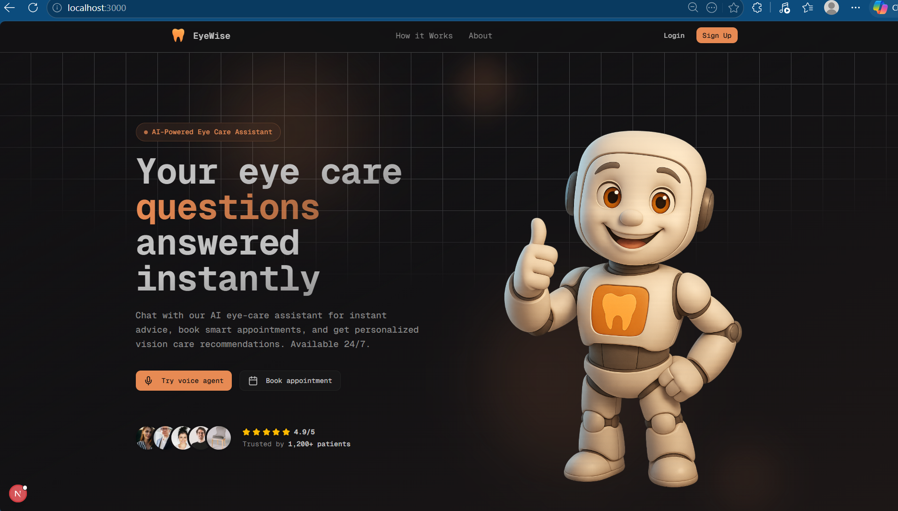
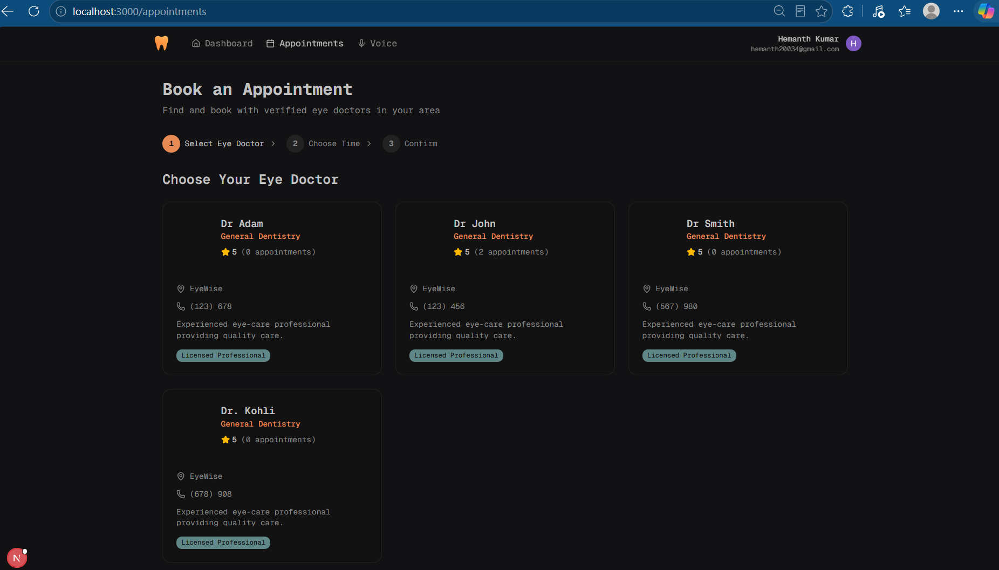
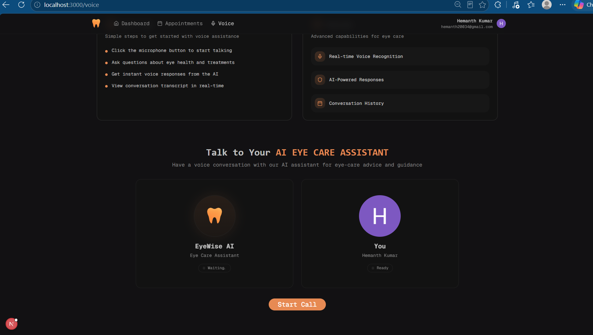
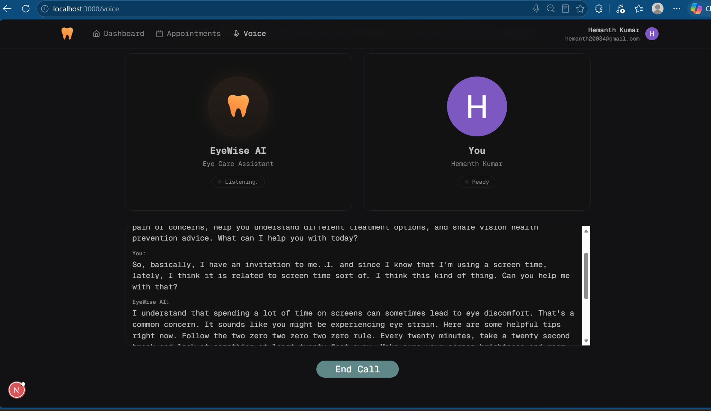
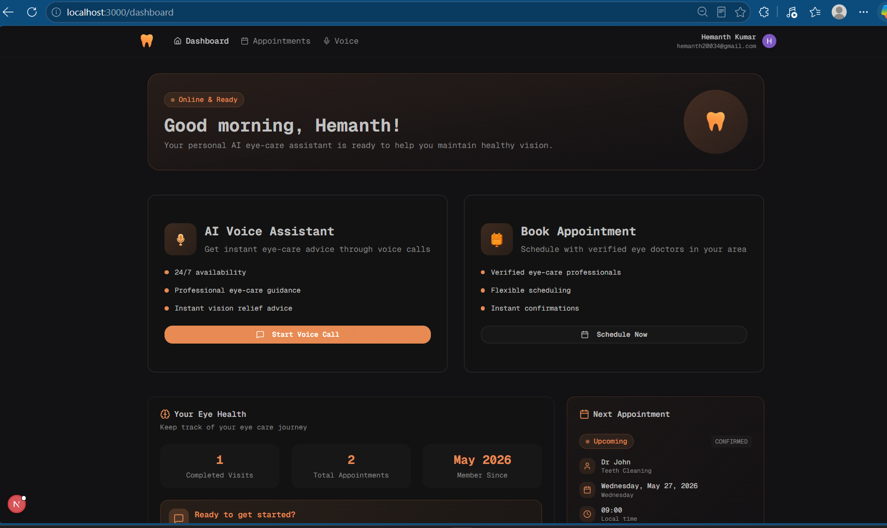

<h1 align="center">EyeWise – Eye Care Platform with AI Voice Agent</h1>

## Highlights

- Modern responsive UI with Tailwind CSS & Shadcn UI
- Secure authentication using Clerk
- Appointment booking workflow for eye consultations
- AI Voice Assistant powered by Vapi
- Admin dashboard for appointment management
- PostgreSQL database integration
- Data fetching with TanStack Query
- Email notifications using Resend

---

## Tech Stack

- Next.js
- TypeScript
- Tailwind CSS
- Shadcn UI
- Clerk
- PostgreSQL
- TanStack Query
- Vapi
- Resend

---

## Glimpses

### 🏠 Home Page



---

### 📅 Appointment Booking



---

### 🗣️ AI Voice Assistant Scheduling



---

### 💬 Chat with AI Assistant



---

### 📊 Admin Dashboard



---

## Run the App

```bash
npm install
npm run devr friendly
